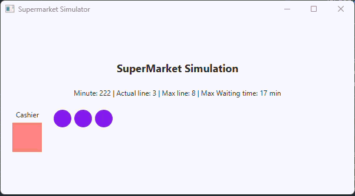

# SuperMarketSimulation
A visual simulation built with JavaFX that models the behavior of a checkout line in a grocery store. The system calculates waiting times, random customer arrivals, and cashier efficiency.

Customer Arrival: Circles appear in the queue container at random intervals.
Processing: The cashier square changes color to Coral when a customer is being served.
Queue Updates: The "Actual line" and "Max line" statistics update every simulation minute.
Completion: A final message appears once the 720-minute cycle is finished.

Features
Real-time Simulation: Uses a Timeline to advance the simulation minute by minute.
Dynamic Graphics: Visual representation of the queue using circles and color-coded cashier states.
Live Statistics: Real-time tracking of:
Current minute of the day.
Actual queue length vs. maximum queue length.
Maximum waiting time recorded.
End-of-Day Summary: Automatically stops after 720 minutes (12 hours) with a concluding message.

Technologies:
Java 17 (or higher)

JavaFX 17

Maven (Dependency management)
